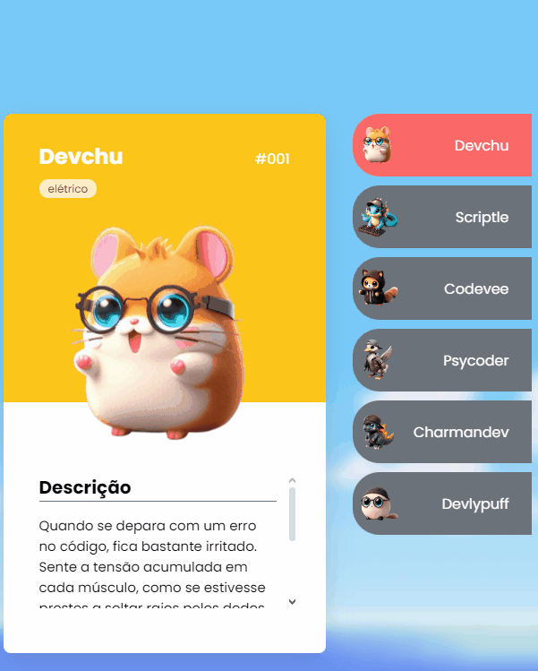

# Projeto com README
Um projeto de teste com um arquivo README 👍



## Tecnologias utilizadas
- HTML
- CSS
- JS

## Como utilizar 

1 - Clone pro projeto
```
git clone <url>
```

2 - Acesse a pasta do projeto
```
git clone
```
3 - cd repositorio-com-readme
```
git clone